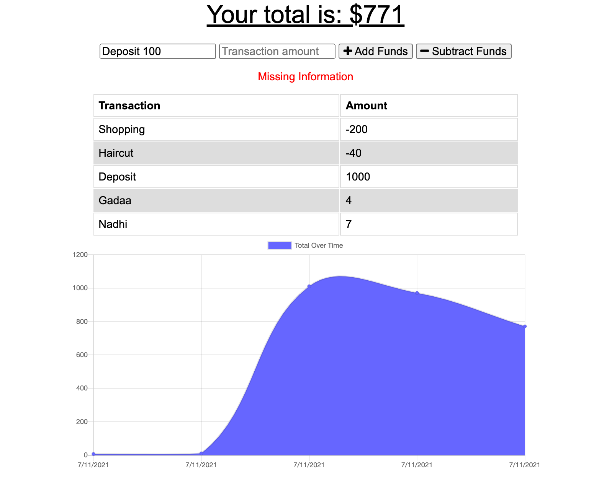

# Progressive-Budget
## Disclaimer for Assignment
In order to give the class more time to focus on React, the solution for this homework assignment was provided by our instructor during class. All code is this repo is from the provided solution.

# Table of Contents
* [Description](#description)
* [Installation](#installation)

# Description
The purpose of this assignment is to create a progressive budget application that allows users to manage financial activity while online or offline.

Overall, the user should be able to add expenses and deposits to their budget with or without an internet connection. When entering transactions offline, they should populate the total when brought back online.

The list below outlines the main functionality for this application:

Offline Functionality:

Enter deposits offline

Enter expenses offline

When brought back online:

Offline entries should be added to tracker.

# Images 
Data can be visualized using chart in the front end.

# Installation

All NPM packages needed for this application are already listed as dependencies in the package.json file. If running this web application in your local environment, please make sure to run the npm install command in your terminal at the root directory level in order to access all required package.

### Start Application
After all required dependencies have been installed using the instructions in the Installation Instructions section, run the command srart in you the terminal under the root directory in order to launch the application in your local environment.

https://budget001.herokuapp.com/